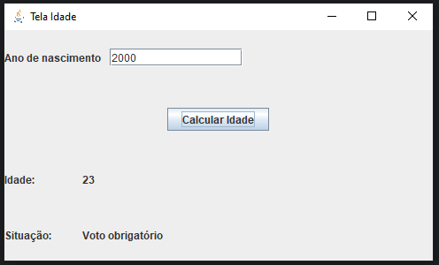

Nesse projeto, foi possível aprender sobre operadores ternários e operadores lógicos no Java.

Além disso, a TelaIdade (feita com swing) foi utilizada para colocar em prática os operadores aprendidos.

Veja uma imagem do projeto simples:

Ícone utilizado: Flaticon.